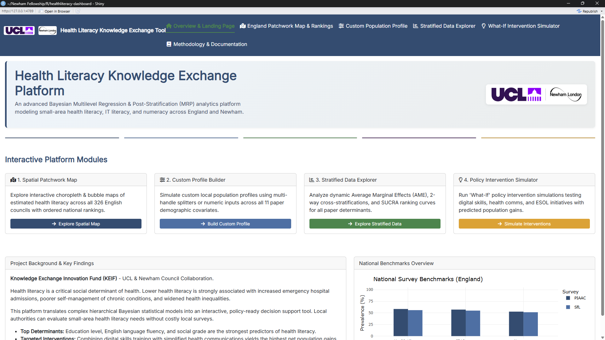

# Health Literacy Dashboard

R dashboard for the UCL Newham Fellowship health literacy project.

This repository contains the code and resources for an interactive R dashboard used to explore and present findings from the UCL Newham Fellowship health literacy study in Newham.

Published on Posit Cloud Connect:
https://019fcd9f-16a8-15d0-4b1b-27cdca68c3c8.share.connect.posit.cloud/

## Contents

- R scripts and shiny files that make up the dashboard
- Supporting data (where included) and helper scripts
- Documentation and usage instructions

## Features

- Interactive visualisations of health literacy metrics
- Filters and breakdowns by demographic groups and survey items
- Exportable summary tables and plots

## Screenshot


*Health Literacy Knowledge Exchange Platform — interactive dashboard showing modules, background and benchmark charts.*

## Requirements

- R (>= 4.0)
- RStudio or Posit
- Recommended R packages: shiny, rmarkdown, flexdashboard, tidyverse, DT, plotly

Install commonly used packages with:

```r
install.packages(c("shiny", "rmarkdown", "flexdashboard", "tidyverse", "DT", "plotly"))
```

If the project uses renv, restore packages with:

```r
if (file.exists("renv.lock")) {
  install.packages("renv")
  renv::restore()
}
```

## Running the dashboard locally

Open this project in RStudio and run one of the following depending on the project layout:

```r
shiny::runApp("app.R")
```

## Data

If data files are included, be mindful of privacy and licensing; do not commit personally identifying information. If the full dataset cannot be published, include a small example dataset or instructions to obtain the data.

## Development & Contributing

Contributions, issues and feature requests are welcome. Suggested workflow:

1. Fork the repository
2. Create a branch: `git checkout -b my-feature`
3. Make changes and add tests where appropriate
4. Commit and push your branch
5. Open a pull request describing your changes

Please open an issue to discuss major changes before submitting large PRs.
